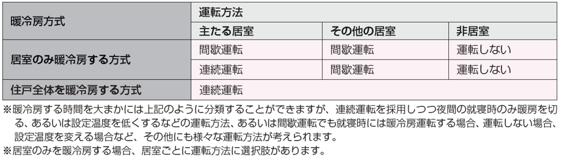

== 冷房設備計画

=== タブの下の表示項目

目標レベル A (冷房エネルギー削減率B%程度)

=== タブ下の説明

見出し::
冷房設備計画とは

説明::
// 暖房と同様になにかここに文章が必要
省エネルギーを踏まえた冷房設備の計画・設計を行うためには、適切な設備機器の選定や配置のための基本的な知識が必要となります。 +
冷房方式の選択と目標レベルの設定は、住宅の断熱仕様、世帯構成や在宅時間、住まい手が求める快適性の水準とコストとのバランス等に配慮して行います。 +
冷房方式の選択の前に、[underline]#建物外皮の性能# 、[underline]#世帯構成及び在宅時間# 、 を事前に確認してください。なお、本評価方法では、熱交換換気を採用することによる冷房（顕熱または潜熱）負荷の低減は見込んでおりません。

【ポップアップ：建物外皮の性能】::
建物外皮の日射熱遮蔽性能の把握は、冷房設備計画の基本となります。気候条件にふさわしい日射熱遮蔽性能の水準の仕様を選択し、それらを考慮して冷房設備を検討することが必要になります。

【ポップアップ：世帯構成及び在宅時間】::
世帯構成や在宅時間については、例えば単身世帯のように不在がちで在宅時間の短い場合と、在宅勤務や高齢者のいる世帯のように在宅時間の長い場合とで、選択すべき冷房設備方式は異なってきます。単身世帯のように在宅時間が短い場合であれば、間欠運転の部分暖冷房で十分といえます。連続運転方式を採用すると、不在時に無駄になるエネルギー消費が発生します。在宅勤務や高齢者を含む世帯のように比較的在宅時間の長い世帯では、室内環境が良くなる連続運転を目指した全館方式を検討してください。

=== 環境条件
なし

=== 入力

[[CS_operation]]
==== 冷房方式の選択

説明::
====
冷房方式を「居室のみを冷房する」および「住戸全体を冷房する」に分類し、それぞれの方式に適用する冷房設備機器を設定します。 +
[underline]#冷房方式と運転方法の分類#
====

ポップアップ：冷房方式と運転方法の分類::
====
冷房方式には、居室のみを冷房する方式と、住戸全体を冷房する方式があります。 +
居室のみを冷房する方式とは、冷房期間中、居室のみを冷房する一方で、廊下や脱衣室等の非居室は冷房しない方式をいいます。さらに、暖房と同様に、それぞれの居室の運転方法として、連続運転と間歇運転に分けられますが、本評価方法ではいずれも間歇運転のみで評価することとしています。 +
住戸全体を暖冷房する方式とは、暖冷房期間中、居室すべてと、クローゼット、倉庫、食品庫などを除く廊下などの非居室を暖冷房する方式です。住戸全体を暖房・冷房するには時間がかかるため、通常、連続運転が採用されます。 +

表 暖冷房方式と運転方法

間歇運転とは、住まい手が在室している時間のみ冷房を行う方法です。この場合、就寝時に冷房を運転する場合としない場合があります。 +
連続運転とは、住まい手が部屋に居ない時間も含めて24 時間冷房を運転したままにしておく方法です。ただし、旅行などの長期外出時には停止します。また、就寝時のみ停止するか、温度設定を変えるなどして暖房を弱めるなどの措置が行われる場合もあります。本評価方法では居室のみを冷房する方式の場合は主たる居室とその他の居室ともに間歇運転で評価することとしています。 +
主たる居室とは、リビング・ダイニング・台所などの比較的在室時間の長い居室を指し、その他の居室とは、子供室や寝室など主たる居室以外の就寝時を除き比較的在室時間が短い居室を指します。また、非居室とは、廊下や浴室・便所等の居室以外の空間を指します。
====

===== a. 冷房方式の選択 [選択入力]

選択肢::
* 住戸全体を冷房する
* 居室のみを冷房する [D]

[[CS_for_whole_house]]
==== 住戸全体の冷房設備

表示条件::
「<<CS_operation>>」「a. 冷房方式の選択」=「住戸全体を冷房する」

===== a. 冷房設備機器の種類 [選択入力]

表示条件::
「<<CS_operation>>」「a. 冷房方式の選択」＝「住戸全体を冷房する」

説明::
====
冷房設備機器を選択します。住戸全体を冷房する方式では、選択できる冷房設備機器はダクト式セントラル空調機(ヒートポンプ熱源)のみとなっています。
====

選択肢::
* ダクト式セントラル空調機(ヒートポンプ熱源)

===== b. 定格能力および定格消費電力の入力 [選択入力]

表示条件::
「a. 冷房設備機器の選択」＝「ダクト式セントラル空調機(ヒートポンプ式)」

説明::
====
定格能力および定格消費電力は、JIS B 8615-2 (エアコンディショナ−第2部：ダクト接続形エアコンディショナと空気対空気ヒートポンプ　定格性能及び運転性能試験)に基づいて測定された値を入力してください。
====

選択肢::
* 入力しない [D]
* 定格能力および定格消費電力を入力することにより省エネルギー効果を評価する

===== c. 定格冷房能力 [数値入力]

表示条件::
「b. 定格能力および定格消費電力の入力」=「定格能力および定格消費電力を入力することにより省エネルギー効果を評価する」

入力規則::
最小値=1000, 最大値=30000, 小数点=0, 規定値=7100, 単位=W

===== d. 定格冷房消費電力 [数値入力]

表示条件::
「b. 定格能力および定格消費電力の入力」＝「定格能力および定格消費電力を入力することにより省エネルギー効果を評価する」

入力規則::
最小値=100, 最大値=15000, 小数点=0, 規定値=2240, 単位=W

===== e. 風量補正 [選択入力]

表示条件::
「a. 冷房設備機器の選択」＝「ダクト式セントラル空調機(ヒートポンプ式)」

説明::
====
「風量補正なし」は、圧力損失によって送風機の出力が変わらない機器の場合に選択してください。「風量補正あり」は、圧力損失によって送風機の出力が変わる機器の場合に選択してください。
====

選択肢::
* 風量補正なし [D]
* 風量補正あり

==== f. 消費電力補正係数(風量補正なし) [数値入力]

表示条件::
「e. 風量補正」=「風量補正なし」

説明::
====
消費電力量補正係数とは、ダクト等の圧力損失によって増加する消費電力を考慮するための係数で、風量補正の有無やダクトの断熱被覆の状況を考慮して計算します。
====

入力規則::
最小値=1.00, 最大値=9.99, 小数点=2, 規定値=1.69

===== g. 消費電力補正係数(風量補正あり) [数値入力]

表示条件::
「e. 風量補正」=「風量補正あり」

説明::
====
消費電力量補正係数とは、ダクト等の圧力損失によって増加する消費電力を考慮するための係数で、風量補正の有無やダクトの断熱被覆の状況を考慮して計算します。
====

入力規則::
最小値=1.00, 最大値=9.99, 小数点=2, 規定値=1.40

[[CS_for_main_room]]
==== 主たる居室の冷房設備

表示条件::
「<<CS_operation>>」「a. 冷房方式の選択」=「居室のみを冷房する」

===== a. 冷房設備機器または放熱器の種類 [選択入力]

表示条件::
「<<CS_operation>>」「a. 冷房方式の選択」=「居室のみを冷房する」

説明::
====
「居室のみを冷房する」を選択した場合は、「主たる居室」と「その他の居室」ごとに、設置する冷房設備機器等を選択して下さい。
====

選択肢::
* ルームエアコンディショナー
* その他の冷房設備機器
* 冷房設備機器または放熱器を設置しない [規定値]

===== b. 省エネルギー対策の有無および種類 [選択入力]

表示条件::
「a.冷房設備機器または放熱器の種類」=「ルームエアコンディショナー」

説明::
====
「特に省エネルギー対策をしていない」は、省エネルギー対策に取り組んでいない場合、あるいは特に省エネルギー対策を評価しない場合に選択して下さい。設置される機器のエネルギー消費効率が不明な場合もこちらを選択して下さい。 +
「エネルギー消費効率の区分を入力することにより省エネルギー効果を評価する」は、エネルギー消費効率の区分によって省エネルギー効果を評価する場合に選択して下さい。
====

選択肢::
* 特に省エネルギー対策をしていない [D]
* エネルギー消費効率の区分を入力することにより省エネルギー効果を評価する

===== c. エネルギー消費効率の区分 [選択入力]

表示条件::
「b.省エネルギー対策の有無および種類」=「エネルギー消費効率の区分を入力することにより省エネルギー効果を評価する」

説明::
====
エネルギー消費効率の区分とは、冷房定格能力の大きさごとに定格冷房エネルギー消費効率の程度に応じて3段階に区分したものです。
====

選択肢::
* 区分(い)
* 区分(ろ) [D]
* 区分(は)

===== d. 容量可変コンプレッサー [選択入力]

表示条件::
「b.省エネルギー対策の有無および種類」=「エネルギー消費効率の区分を入力することにより省エネルギー効果を評価する」

説明::
====
容量可変型コンプレッサーとは、一回転あたりのシリンダ容積（押のけ量）を変化させて単位時間あたりの冷媒循環量を制御する機械式容量制御を採用したコンプレッサーのことです。
複数のルームエアコンディショナーが設置される場合で、容量可変型コンプレッサーの搭載の有無が異なる場合は、「搭載しない」を選択して下さい。
====

選択肢::
* 搭載しない [D]
* 搭載する

===== e. その他の暖房設備機器の名称 [テキスト入力]

表示条件::
「a. 冷房設備機器または放熱器の種類」=「その他の暖房設備機器」

[[CS_for_other_room]]
==== その他の居室の暖房設備

表示条件::
「<<CS_operation>>」「a. 冷房方式の選択」=「居室のみを暖房する」

NOTE: 以下の選択項目は、<<CS_for_main_room>>の項目a)～e)と全く同じ。
