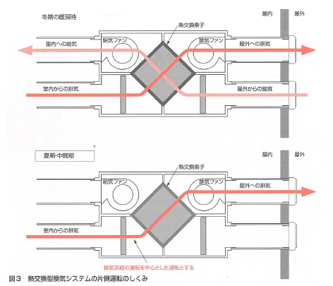

== 換気設備計画
hoge
=== タブの下の表示項目

目標レベル A (換気エネルギー削減率 B%程度)

=== タブの下の説明

見出し::
換気設備計画とは

説明::
機械換気で夏期や冬期に開口部(窓)を閉め切った状態においても、建築基準法で求められている0.5回/h以上の換気量を確保し、住宅内の空気環境を安全・快適に保つことを目的とした主として全般換気に関する技術です。 +
この機械換気に要するエネルギーをいかに節約するかが、また機械換気にともない生じる暖房負荷をいかに低減するかが、換気設備の省エネルギー技術として重要です。

=== 環境条件
なし

=== 入力

[[MV_type]]
==== 換気設備の方式

説明::
====
手法を検討する前提として、地域性や住宅の断熱性・気密性等を考慮して採用する換気設備を確認することが重要です。 +
換気設備については、[underline]#換気設備の種類# と、採用する方式 ( [underline]#熱交換型換気の採用の有無# )を確認し、換気設備における省エネルギー化の可能性を検討します。
====

【ポップアップ：換気設備の種類】::
====
換気設備は換気方式により第一種、第二種、第三種方式があります、また、ダクト式換気設備と壁付け式換気設備があり、それらの省エネルギーのためには、ダクトや外部フードに起因する圧力損失の低減、高効率ファンの採用及び換気量を長期にわたり維持するためのメンテナンスを意識した計画と住まい手への注意喚起が必要です。
換気システムは以下のように４分類に大別できますので、この中から設置する換気システムを選択します。

[horizontal]
方式１－１:: ダクト式換気システム(第一種)
方式１－２:: ダクト式換気システム(第二種、第三種、ハイブリッド換気)
方式２－１:: 壁掛け式換気システム(第一種)
方式２－２:: 壁掛け式換気システム(第二種、第三種)

詳しくはガイドラインを参照してください。
====

【ポップアップ：熱交換型換気の採用の有無】::
====
　ダクト式第一種換気設備、壁掛け式第一種換気設備には室内からの排気と、取り入れ外気の間で熱交換をする事により、主に暖房にかかるエネルギーを削減するための熱回収換気送装置（熱交換器）を採用している機種があります。冬期の換気による暖房負荷低減のほか、取り入れ外気の予熱による不快感の低減には、熱交換器を使用することにより一定の省エネルギー効果があります。
熱交換型換気設備を設置する場合には、熱交換タブで選択してください。
====

===== a. 換気設備の方式の入力 [選択入力]

選択肢::
* ダクト式第1種換気設備
* ダクト式第1種換気設備(熱交換あり)
* ダクト式第3種換気設備
* ダクト式第2種換気設備
* 壁掛け式第1種換気設備
* 壁掛け式第1種換気設備(熱交換あり)
* 壁掛け式第2種換気設備
* 壁掛け式第3種換気設備 [D]

[[MV_type1_duct]]
==== ダクト式第1種換気設備を設置する場合

表示条件::
「<<MV_type>>」「a. 換気設備の方式の入力」=「ダクト式第1種換気設備」

===== a. 省エネルギー対策の有無と評価の方法 [選択入力]

表示条件::
「<<MV_type>>」「a. 換気設備の方式の入力」=「ダクト式第1種換気設備」

説明::
====
[underline]#省エネルギー対策を選択する方法# と、 [underline]#比消費電力# を入力することにより省エネルギーを評価する方法があります。
====

【ポップアップ：比消費電力】::
====
比消費電力は、換気量1(m^3^/h)を搬送するのにかかる消費電力(W)のことで、値が小さい方が省エネであるといえます。 +
比消費電力の計算は、以下の式で求められます。 +

比消費電力(W/(m^3^/h)) ＝ 消費電力 ÷ 風量 +

消費電力: カタログに記載されている消費電力の値(W) +
風量: 圧力損失計算を行って得られた風量(m^3^/h)（ダクト等の換気部材を接続しない状態、いわゆる開放状態における風量ではないことに注意が必要です。)
====

【ポップアップ：省エネルギー対策を選択する方法】::
====
次の省エネルギー手法を選択します。

[horizontal]
手法1:: ダクト等の圧力損失低減
手法2:: 高効率機器の導入

目的に応じて採用する省エネルギー手法を選択してください。 +
なお、手法2 高効率機器の導入は、手法1 のダクト等の圧力損失低減 を採用していることが前提となります。
====

選択肢::
* 特に省エネルギー対策をしない・評価しない [D]
* 採用した省エネルギー手法を選択し省エネルギー効果を評価する
* 比消費電力を入力し省エネルギー効果を評価する

===== b. 比消費電力の入力 [数値入力]

表示条件::
「a. 省エネルギー対策の有無と評価の方法」=「比消費電力を入力し省エネルギー効果を評価する」

入力規則::
最小値=0.01, 最大値=2.00, 小数点=2位, 規定値=2.00

===== c. 【手法1】ダクト等の圧力損失低減 [選択入力]

表示条件::
「a. 省エネルギー対策の有無と評価の方法」＝「採用した省エネルギー手法を選択し省エネルギー効果を評価する」

説明::
====
ダクト径の大口径化や、ダクト長さ、曲りにより圧力損失の低減することで、換気設備の運転にかかるエネルギーを削減することができます。 +
住宅の場合、通常は主ダクトで直径100mm、枝ダクトで直径50mmのダクトを用いることが一般的ですが、ダクト等の圧力損失を低減して省エネルギーをはかるには、主ダクトで直径100mm以上、枝ダクトで直径75mm以上のダクトを使用することが効果があります。
====

選択肢::
* 採用する
* 採用しない [D]

==== d. 【手法2】 高効率機器の導入 [選択入力]

表示条件::
「a. 【手法1】ダクト等の圧力損失低減」=「採用する」

説明::
====
比消費電力を目安として、第一種換気システムでは0.4W/（m^3^/h）以下の送風機を選択することを、高効率機器の導入の要件としています 。
====

選択肢::
* 採用する
* 採用しない [D]

[[MV_type1HEX_duct]]
==== ダクト式第1種換気設備(熱交換あり)を設置する場合

表示条件::
「<<MV_type>>」「a. 換気設備の方式の入力」=「ダクト式第1種換気設備(熱交換あり)」

===== a. 省エネルギー対策の有無と評価の方法 [選択入力]

表示条件::
「<<MV_type>>」「a. 換気設備の方式の入力」=「ダクト式第1種換気設備(熱交換あり)」

説明::
====
[underline]#省エネルギー対策を選択する方法# と、 [underline]#比消費電力# を入力することにより省エネルギーを評価する方法があります。
====

【ポップアップ：比消費電力】::
====
比消費電力は、換気量1(m^3^/h)を搬送するのにかかる消費電力(W)のことで、値が小さい方が省エネであるといえます。 +
比消費電力の計算は、以下の式で求められます。 +

比消費電力(W/(m^3^/h)) ＝ 消費電力 ÷ 風量 +

消費電力: カタログに記載されている消費電力の値(W) +
風量: 圧力損失計算を行って得られた風量(m^3^/h)（ダクト等の換気部材を接続しない状態、いわゆる開放状態における風量ではないことに注意が必要です。)
====

【ポップアップ：省エネルギー対策を選択する方法】::

====
次の省エネルギー手法を選択します。

[horizontal]
手法1:: ダクト等の圧力損失低減
手法2:: 高効率機器の導入
手法3:: 熱交換型換気システムの夏期・中間期の効率的運転

目的に応じて採用する省エネルギー手法を選択してください。 +
なお、手法2 高効率機器の導入は、手法1 のダクト等の圧力損失低減 を採用していることが前提となります。
====

選択肢::
* 特に省エネルギー対策をしない・評価しない [D]
* 採用した省エネルギー手法を選択し省エネルギー効果を評価する
* 比消費電力を入力し省エネルギー効果を評価する

===== b. 比消費電力の入力 [数値入力]

表示条件::
「a. 省エネルギー対策の有無と評価の方法」=「比消費電力を入力し省エネルギー効果を評価する」

入力規則::
最小値=0.01, 最大値=2.00, 小数点=2位, 規定値=2.00

===== c. 【手法1】ダクト等の圧力損失低減 [選択入力]

表示条件::
「a. 省エネルギー対策の有無と評価の方法」＝「採用した省エネルギー手法を選択し省エネルギー効果を評価する」

説明::
====
ダクト径の大口径化や、ダクト長さ、曲りにより圧力損失の低減することで、換気設備の運転にかかるエネルギーを削減することができます。 +
住宅の場合、通常は主ダクトで直径100mm、枝ダクトで直径50mmのダクトを用いることが一般的ですが、ダクト等の圧力損失を低減して省エネルギーをはかるには、主ダクトで直径100mm以上、枝ダクトで直径75mm以上のダクトを使用することが効果があります。
====

選択肢
* 採用する
* 採用しない [D]

===== d. 【手法2】 高効率機器の導入 [選択入力]

表示条件::
「a. 【手法1】ダクト等の圧力損失低減」=「採用する」

説明::
比消費電力を目安として、第一種換気システムでは0.4W/（m^3^/h）以下の送風機を選択することを、高効率機器の導入の要件としています 。

選択肢::
* 採用する
* 採用しない [D]

==== e. 【手法3】 熱交換型換気システムの夏期・中間期の効率的運転 [選択入力]

表示条件::
「a. 省エネルギー対策の有無と評価の方法」=「採用した省エネルギー手法を選択し省エネルギー効果を評価する」

説明::
====
熱交換換気システムは、排気によって屋外に捨てられる熱を回収する換気システムで、換気による空調負荷を削減することができます。しかしながら、熱交換素子の狭い部分を空気が通過するため、一般の換気システムよりも送風動力が増加します。したがって、夏期・中間期など、回収熱量が少ない条件では、かならずしも省エネに寄与しません。
換気装置の給気側の運転のみを停止して、第三種換気に切り替える（これを [underline]#片側運転# という）ことで、消費電力が削減されます。
====

【ポップアップ：片側運転】::
====
冬期の暖房時は熱交換素子を通して屋外に捨てられる熱を回収します。 +
夏期・中間期は換気装置の給気側のみを停止して、第三種換気に切換えて片側運転させ、換気装置にかかる消費電力を低減します。

図 熱交換型換気システムの片側運転のしくみ
====

選択肢::
* 採用する
* 採用しない [D]

[[MV_type2_duct]]
==== ダクト式第2種換気設備を設置する場合

表示条件::
「<<MV_type>>」「a. 換気設備の方式の入力」=「ダクト式第2種換気設備」

===== a. 省エネルギー対策の有無と評価の方法 [選択入力]

表示条件::
「<<MV_type>>」「a. 換気設備の方式の入力」=「ダクト式第2種換気設備」

説明::
====
[underline]#省エネルギー対策を選択する方法# と、 [underline]#比消費電力# を入力することにより省エネルギーを評価する方法があります。
====

【ポップアップ：比消費電力】::
====
比消費電力は、換気量1(m^3^/h)を搬送するのにかかる消費電力(W)のことで、値が小さい方が省エネであるといえます。 +
比消費電力の計算は、以下の式で求められます。 +

比消費電力(W/(m^3^/h)) ＝ 消費電力 ÷ 風量 +

消費電力: カタログに記載されている消費電力の値(W) +
風量: 圧力損失計算を行って得られた風量(m^3^/h)（ダクト等の換気部材を接続しない状態、いわゆる開放状態における風量ではないことに注意が必要です。)
====

【ポップアップ：省エネルギー対策を選択する方法】::

====
次の省エネルギー手法を選択します。

[horizontal]
手法1:: ダクト等の圧力損失低減
手法2:: 高効率機器の導入
手法4:: 温度差利用型ハイブリッド換気

目的に応じて採用する省エネルギー手法を選択してください。 +
なお、手法2 高効率機器の導入 および 手法4 温度差利用型ハイブリッド換気 は、手法1 のダクト等の圧力損失低減 を採用していることが前提となります。
====

選択肢::
* 特に省エネルギー対策をしない・評価しない [D]
* 採用した省エネルギー手法を選択し省エネルギー効果を評価する
* 比消費電力を入力し省エネルギー効果を評価する

===== b. 比消費電力の入力 [数値入力]

表示条件::
「a. 省エネルギー対策の有無と評価の方法」=「比消費電力を入力し省エネルギー効果を評価する」

入力規則::
最小値=0.01, 最大値=2.00, 小数点=2位, 規定値=2.00

===== c. 【手法1】ダクト等の圧力損失低減 [選択入力]

表示条件::
「a. 省エネルギー対策の有無と評価の方法」=「採用した省エネルギー手法を選択し省エネルギー効果を評価する」

説明::
====
ダクト径の大口径化や、ダクト長さ、曲りにより圧力損失の低減することで、換気設備の運転にかかるエネルギーを削減することができます。 +
住宅の場合、通常は主ダクトで直径100mm、枝ダクトで直径50mmのダクトを用いることが一般的ですが、ダクト等の圧力損失を低減して省エネルギーをはかるには、主ダクトで直径100mm以上、枝ダクトで直径75mm以上のダクトを使用することが効果があります。
====

選択肢::
* 採用する
* 採用しない [D]

===== d. 【手法2】 高効率機器の導入 選択入力

表示条件::
「a. 【手法1】ダクト等の圧力損失低減」=「採用する」

説明::
====
比消費電力を目安として、第2種・第3種換気システムでは0.2W/（m^3^/h）以下の送風機を選択することを、高効率機器の導入の要件としています 。
====

選択肢::
* 採用する
* 採用しない [D]

==== e. 【手法4】 温度差利用型ハイブリッド換気 [選択入力]

表示条件::
「a. 【手法1】ダクト等の圧力損失低減」=「採用する」

説明::
====
[underline]#温度差利用型ハイブリッド換気システム# は、室内温度と外気温度の差が大きい冬期には、煙突効果を利用した自然換気を行い、十分な室内外温度差がない条件では機械換気装置を稼働させるものです。機械換気装置は、第二種換気や第三種換気を用います。有効な温度差利用型ハイブリッド換気の利用条件はガイドラインを参照してください。

【ポップアップ：温度差利用型ハイブリッド換気システム】

image::images/MechanicalVentilation/ondosahaiburiddokankishisutemunoshikumi.png[]

図 温度差利用型ハイブリッド換気システム
====

選択肢::
* 採用する
* 採用しない [D]

[[MV_type3_duct]]
==== ダクト式第3種換気設備を設置する場合

表示条件::
「<<MV_type>>」「a. 換気設備の方式の入力」=「ダクト式第3種換気設備」

NOTE: 表示条件・説明・選択項目は、<<MV_type2_duct>>と同じ。

[[MV_type1_wall]]
==== 壁掛け式第1種換気設備を設置する場合

表示条件::
「<<MV_type>>」「a. 換気設備の方式の入力」=「壁掛け式第1種換気設備」

===== a. 省エネルギー対策の有無と評価の方法 [選択入力]

表示条件::
「<<MV_type>>」「a. 換気設備の方式の入力」=「壁掛け式第1種換気設備」

説明::
====
[underline]#省エネルギー対策を選択する方法# と、 [underline]#比消費電力# を入力することにより省エネルギーを評価する方法があります。
====

【ポップアップ：比消費電力】::
====
比消費電力は、換気量1(m^3^/h)を搬送するのにかかる消費電力(W)のことで、値が小さい方が省エネであるといえます。 +
比消費電力の計算は、以下の式で求められます。 +

比消費電力(W/(m^3^/h)) ＝ 消費電力 ÷ 風量 +

消費電力: カタログに記載されている消費電力の値(W) +
風量: 圧力損失計算を行って得られた風量(m^3^/h)（ダクト等の換気部材を接続しない状態、いわゆる開放状態における風量ではないことに注意が必要です。)
====

【ポップアップ:省エネルギー対策を選択する方法】::
====
次の省エネルギー手法を選択します。 +
・手法5 ファンと屋外端末の組み合わせの適正化 +
目的に応じて採用する省エネルギー手法を選択してください。
====

選択肢::
* 特に省エネルギー対策をしない・評価しない [D]
* 採用した省エネルギー手法を選択し省エネルギー効果を評価する
* 比消費電力を入力し省エネルギー効果を評価する

===== b. 比消費電力の入力 [数値入力]

表示条件::
「a. 省エネルギー対策の有無と評価の方法」＝「比消費電力を入力し省エネルギー効果を評価する」

入力規則::
最小値=0.01, 最大値=2.00, 小数点=2位, 規定値=2.00

===== c. 【手法5】ファンと屋外端末の組み合わせの適正化 [選択入力]

表示条件::
「a. 省エネルギー対策の有無と評価の方法」=「採用した省エネルギー手法を選択し省エネルギー効果を評価する」

説明::
====
エネルギー効率の高いファンと圧力損失の小さな屋外端末を組み合わせることを意味します。 +
第1種については比消費電力が0.48W/(m^3^h)以下を要件とします。
====

===== 選択肢
* 採用する
* 採用しない [D]

[[MV_type1HEX_wall]]
==== 壁掛け式第1種換気設備(熱交換あり)を設置する場合

表示条件::
「<<MV_type>>」「a. 換気設備の方式の入力」=「壁掛け式第1種換気設備(熱交換あり)」

NOTE: 表示条件・説明・選択肢等は、<<MV_type1_wall>>と同じ。

[[MV_type2_wall]]
==== 壁掛け式第2種換気設備を設置する場合

表示条件::
「<<MV_type>>」「a. 換気設備の方式の入力」=「壁掛け式第2種換気設備」

NOTE: 表示条件・説明・選択肢等は、<<MV_type1_wall>>と同じ。

[[MV_type3_wall]]
==== 壁掛け式第3種換気設備を設置する場合

表示条件::
「<<MV_type>>」「a. 換気設備の方式の入力」=「壁掛け式第3種換気設備」

NOTE: 表示条件・説明・選択肢等は、<<MV_type1_wall>>と同じ。

[[MV_ventilation_rate]]
==== 換気回数

説明::
====
建築基準法施行令第20条の7第1項第2号の表における「住宅の居室」の分類に従い換気回数を選択します。
必要 換気回数を選択します。
====

===== a. 換気回数の入力 [選択入力]

選択肢::
* 0回/h
* 0.5回/h [D]
* 0.7回/h

[[MV_effective_ventilating_volume_rate]]
==== 15) 第1種換気設備の場合における有効換気量率

表示条件::
「<<MV_type>>」「a. 換気設備の方式の入力」=「ダクト式第1種換気設備」または +
「<<MV_type>>」「a. 換気設備の方式の入力」=「ダクト式第1種換気設備(熱交換あり)」または +
「<<MV_type>>」「a. 換気設備の方式の入力」=「壁掛け式第1種換気設備」または +
「<<MV_type>>」「a. 換気設備の方式の入力」=「壁掛け式第1種換気設備(熱交換あり)」

説明::
====
ダクト式第一種換気設備の場合における有効換気量率を入力します 。 +
有効換気量率とは、JRA　4056-2006　全熱交換器有効換気量試験法に則って計測された有効換気量の給気に対する比率のことです。
====

===== a. 有効換気量率の入力 [数値入力]

表示条件::
「<<MV_type>>」「a. 換気設備の方式の入力」=「ダクト式第1種換気設備」または +
「<<MV_type>>」「a. 換気設備の方式の入力」=「ダクト式第1種換気設備(熱交換あり)」または +
「<<MV_type>>」「a. 換気設備の方式の入力」=「壁掛け式第1種換気設備」または +
「<<MV_type>>」「a. 換気設備の方式の入力」=「壁掛け式第1種換気設備(熱交換あり)」

入力規則::
最小値=0.01, 最大値=1.00, 小数点=2位, 規定値=1.00

[[MV_heat_exchanger]]
==== 熱交換換気設備性能

表示条件::
「<<MV_type>>」「a. 換気設備の方式の入力」=「ダクト式第1種換気設備(熱交換あり)」または +
「<<MV_type>>」「a. 換気設備の方式の入力」=「壁掛け式第1種換気設備(熱交換あり)」

説明::
====
熱交換換気設備を設置した場合、以下の仕様を入力します。 +
・温度交換効率 +
・給気と排気の比率による温度交換効率の補正係数 +
・排気過多時における住宅外皮経由の漏気による温度交換効率の補正係数
====

===== a. 温度交換効率 [数値入力]

表示条件::
「<<MV_type>>」「a. 換気設備の方式の入力」＝「ダクト式第1種換気設備(熱交換あり)」または +
「<<MV_type>>」「a. 換気設備の方式の入力」＝「壁掛け式第1種換気設備(熱交換あり)」

説明::
====
熱交換型換気設備において、給気乾球温度と外気乾球温度の差が還気乾球温度と外気乾球温度の差にどれだけ近いかを表す指標です。 +
JIS B 8628 （全熱交換器）に規定された温度交換効率を入力して下さい。顕熱交換型換気設備の場合も、JIS B 8628に規定された試験方法及び計算方法により計算で求めてください。 +
値は、100分の1未満の端数を切り下げた小数第二位までの値とし、パーセント単位で入力してください（値に100を乗じてください）。ただし、値が95（％）を上回る場合は、95を入力してください。
なお、以下の場合は熱交換型換気設備による暖房負荷の削減効果を見込むことはできません。 +
・温度交換効率ηtが0.4を下回る場合 +
・定格条件における給気風量が定格条件における排気風量の半分未満、若しくは2倍より大きい場合 +
====

入力規則::
最小値=40, 最大値=100, 小数点=0位, 規定値=65

===== b. 補正係数の入力 [選択入力]

表示条件::
「<<MV_type>>」「a. 換気設備の方式の入力」=「ダクト式第1種換気設備(熱交換あり)」または +
「<<MV_type>>」「a. 換気設備の方式の入力」=「壁掛け式第1種換気設備(熱交換あり)」

説明::
「給気と排気の比率による温度交換効率の補正係数」及び「排気過多時における住宅外皮経由の漏気による温度交換効率の補正係数」の入力方法を選択します。  +
予め定められた以下のデフォルト値を使用するか、定格条件および設計時における給気・還気風量から計算します。  +
・給気と排気の比率による温度交換効率の補正係数：0.90
・排気過多時における住宅外皮経由の漏気による温度交換効率の補正係数：1.00

選択肢::
* デフォルト値を使用する [D]
* 定格条件および設計時における給気・還気風量から計算する

===== c. 給気と排気の比率による温度交換効率の補正係数 [数値入力]

表示条件::
「b. 補正係数の入力」＝「定格条件および設計時における給気・還気風量から計算する」

説明::
====
給気と排気の比率による温度交換効率の補正係数 C~bal~ は0.9とするか、もしくは、下式により求めた値を用いることができます。計算により求めた値を用いる場合は、100分の1未満の端数を切り下げた小数第二位までの値としてください。 +
C~bal~ = η~t,d~ ÷ η~t~ +
ここで、 +
η~t,d~：当該住戸における補正設計風量比での熱交換型換気設備の温度交換効率 +
η~t~：熱交換型換気設備の温度交換効率 +
η~t,d~の計算方法は、以下の参照資料に示されています。

住宅・建築物の省エネルギー基準及び低炭素建築物の認定基準に関する技術情報 +
η~t,d~の計算方法は、「設計一次エネルギー消費量算定方法」の「3 暖冷房負荷と外皮性能　3-1全般　付録A熱交換型換気設備」を参照して下さい。
====

入力規則::
最小値=0.00, 最大値=2.00, 小数点=2位, 規定値=0.90

===== d. 排気過多時における住宅外皮経由の漏気による温度交換効率の補正係数 [数値入力]

表示条件::
「b. 補正係数の入力」＝「定格条件および設計時における給気・還気風量から計算する」

説明::
====
給気と排気の比率による温度交換効率の補正係数 C~bal~ は0.9とするか、もしくは、下式により求めた値を用いることができます。計算により求めた値を用いる場合は、100分の1未満の端数を切り下げた小数第二位までの値としてください。 +
C~bal~ = η~t,d~ ÷ η~t~ +
ここで、 +
η~t,d~：当該住戸における補正設計風量比での熱交換型換気設備の温度交換効率 +
η~t~：熱交換型換気設備の温度交換効率 +
η~t,d~の計算方法は、以下の参照資料に示されています。

住宅・建築物の省エネルギー基準及び低炭素建築物の認定基準に関する技術情報 +
η~t,d~の計算方法は、「設計一次エネルギー消費量算定方法」の「3 暖冷房負荷と外皮性能　3-1全般　付録A熱交換型換気設備」を参照して下さい。

排気過多時における住宅外皮経由の漏気による温度交換効率の補正係数C~leak~は、設計給気風量V~d,in~（m^3^/h）と設計還気風量V~d,out~（m^3^/h）を用い、下式により求めた数値を入力します。その際、設計給気風量及び設計還気風量のかわりに設計外気風量及び設計排気風量を用いることもできます。

V~d,in~≧V~d,out~の場合 +
C~leak~=1 +
V~d,in~≧V~d,out~の場合 +
C~leak~=V~d,in~ ÷ V~d,out~ +

住宅・建築物の省エネルギー基準及び低炭素建築物の認定基準に関する技術情報 +
設計給気風量、設計還気風量、設計外気風量及び設計排気風量は、「設計一次エネルギー消費量算定方法」の「5換気設備」に規定された値としてください。
====

入力規則::
最小値=0.00, 最大値=1.00, 小数点=2位, 規定値=1.00
