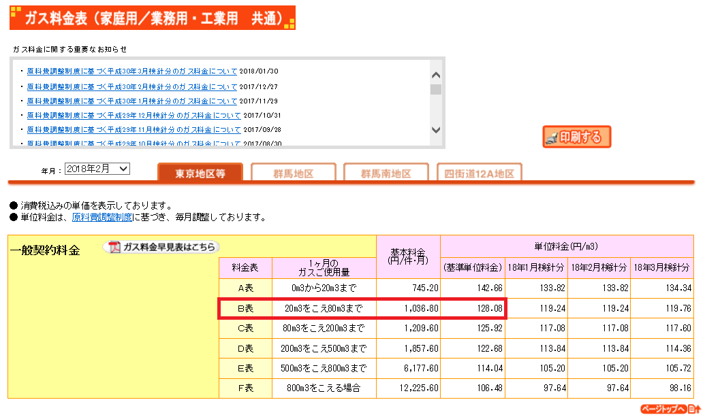

# 燃料単価

2018.2.13 Updated Imai

## 電力
### 自家消費分
27円/kWh（税込）  
公益社団法人全国家庭電気製品公正取引協議会  
https://www.eftc.or.jp/

### 売電分
26円/kWh（税込）  
10kW未満 出力制御対応機器 設置義務なし（H30）  

28円/kWh（税込）  
10kW未満 出力制御対応機器 設置義務あり（H30）

25円/kWh（税込）  
10kW未満 ダブル発電 出力制御対応機器 設置義務なし（H30）

27円/kWh（税込）  
10kW未満 ダブル発電 出力制御対応機器 設置義務あり（H30）	 

資源エネルギー庁
http://www.enecho.meti.go.jp/category/saving_and_new/saiene/kaitori/fit_kakaku.html

## ガス
149円/㎥（税込）  
東京ガス 一般契約料金 1ヶ月のガスご使用量  
東京ガス  
http://e-com.tokyo-gas.co.jp/ryokin/Default.aspx?tik=1

## 灯油
1,664円/18ℓ（税込）
民生用灯油（給油所以外）  
公表　H30年1月31日  
配達価格　全国平均	資源エネルギー庁  
http://www.enecho.meti.go.jp/statistics/petroleum_and_lpgas/pl007/results.html#headline2  
一般財団法人日本エネルギー経済研究所 石油情報センター  
https://oil-info.ieej.or.jp/

## ※ ガス料金　根拠
温暖地ガイドライン 6地域 居室間歇運転  
潜熱回収型給湯機(22.59GJ) + 調理(3.9GJ) = 26.49GJ  
26.49 × 1000 ÷ 45(係数) ÷ 12か月 ＝ 49㎥

49㎥として計算  
基本料金　1036.80 ÷ 49 ＝ 21.16 円/㎥ ①  
従量料金　128.08円/㎥ ②  
①+②＝149円/㎥

