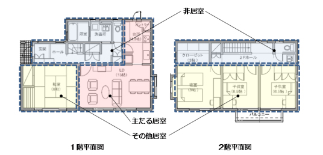
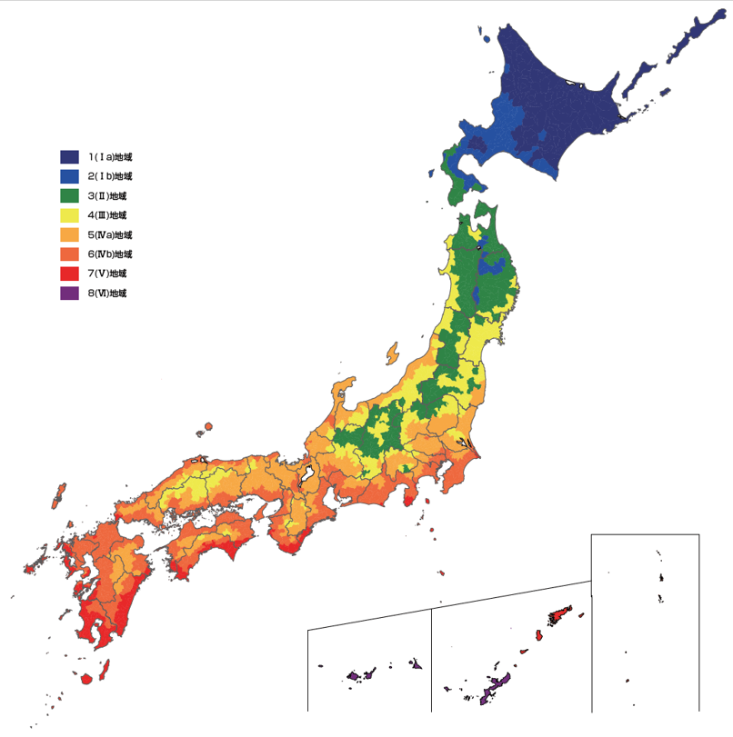
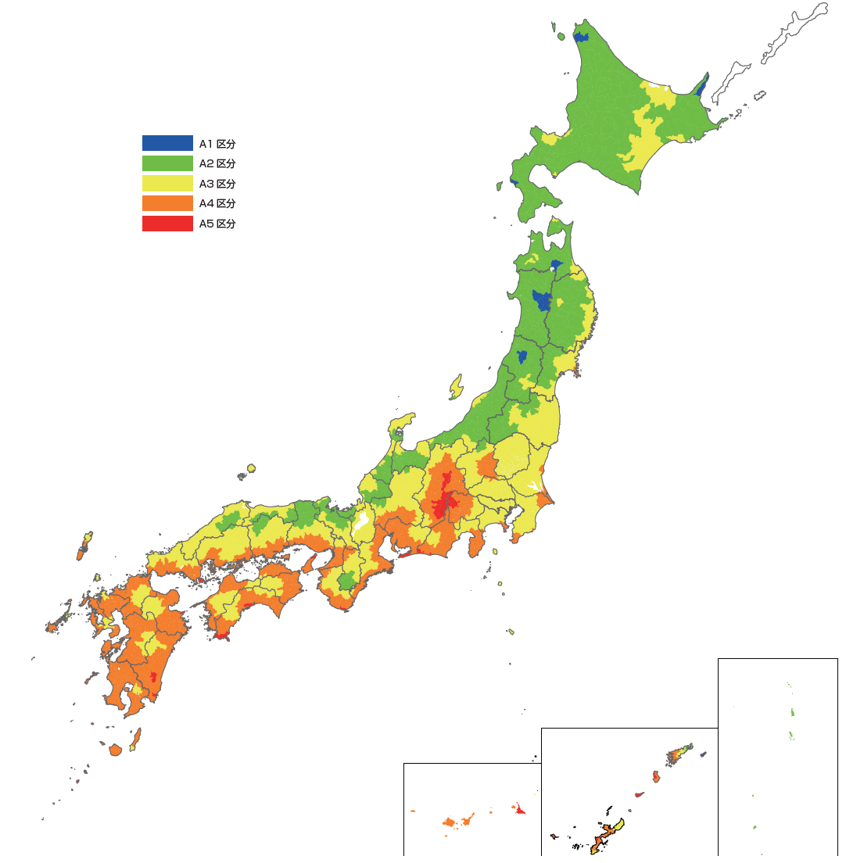
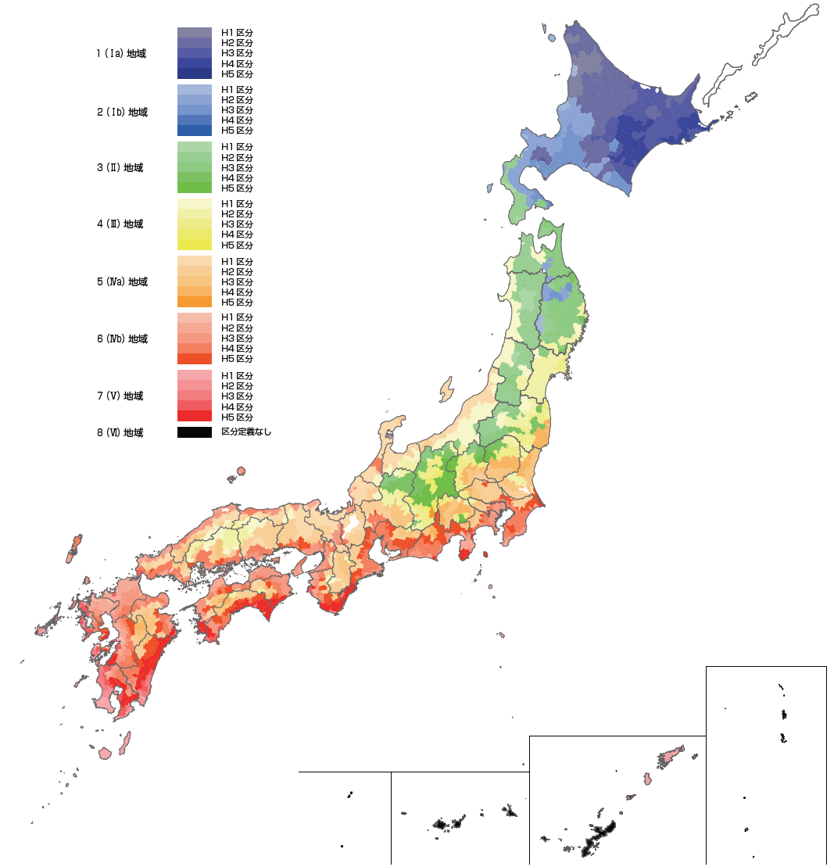
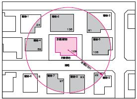
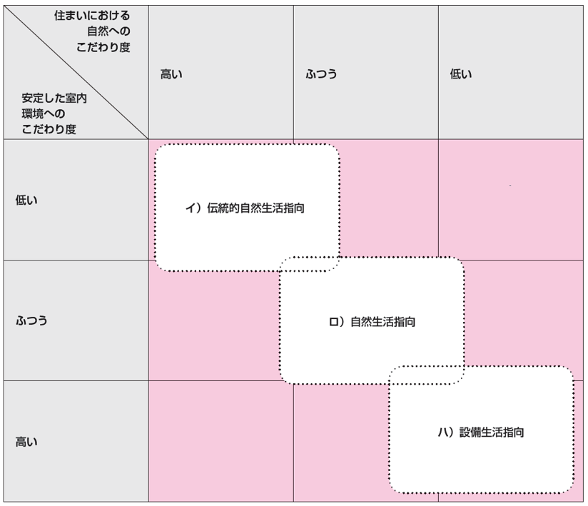
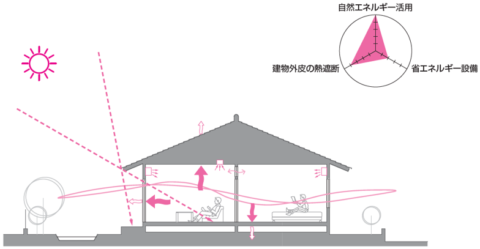
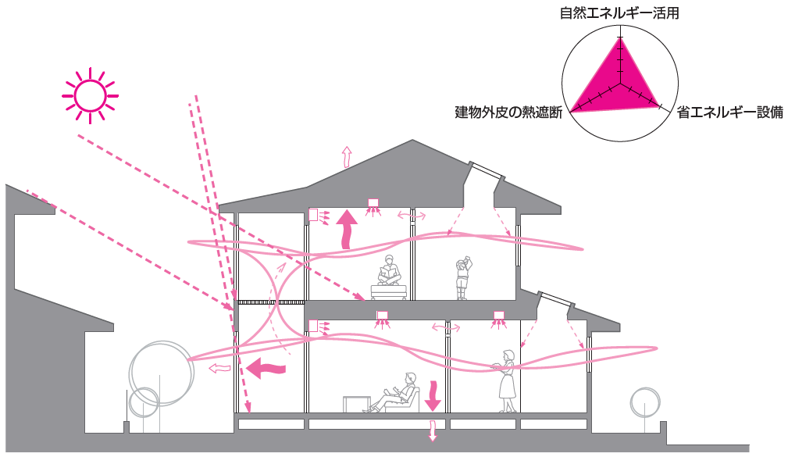
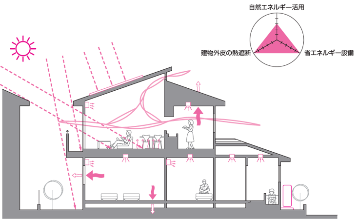

== 全般

=== タブの下の表示項目
なし

=== タブ下の説明

見出し::
基本情報

説明::

[JP]
====
住宅の名称や床面積、地域の区分など、各要素技術に共通の情報を入力します。
====

[EN]
====
Input the general information that is common to all elemental technologies such as name and floor area of the house and the reigional revision. 
====

=== 環境条件
なし

=== 入力

[[GL_house_attribute]]
==== 住宅の属性 / Attribute of House

===== a. 住宅の名称 / Name of House [テキスト入力]

[[GL_room_composition]]
==== 居室の構成 / Composition of Room

説明::

[JP]
====
住宅の一次エネルギー消費量を計算するにあたって、各室を、 [underline]#主たる居室・その他の居室・非居室# の3つに分類します。
====

[EN]
====
Categorize each room into three types of the room as [underline]#"main habitable room", "other habitable room" and "non habitable room"# in order to calculate the primary energy consumption of the house.
====

[ポップアップ] 主たる居室・その他の居室・非居室 / main habitable room, other habitable room and non habitable room::

[JP]
====
主たる居室とは、居室のうち、基本生活行為において、就寝を除き日常生活上在室時間が長い居室のことです。居間（リビング）、食堂（ダイニング）及び台所（キッチン）などが該当します。 +
その他の居室とは、主たる居室以外の居室をいいます。 +
非居室とは、居室以外の空間をいいます。

図．室の分類の例
====

[EN]
====
Main habitable room is the room that the ocupants stay long time in daily life except for bedtime in basic daily activities among the rooms. 

No image

Fig. Example of Categorizing of ROoms
====

===== a. 居室の構成 / Composition of Room [選択入力]

選択肢::
* 主たる居室・その他の居室・非居室で構成される / The house is composed of main habitable room and other habitable rooms and non habitable rooms [規定値]
* それ以外の構成 / Other composition

===== b. その他の居室の有無 / Existence of Other Habitable Rooms [選択入力]

表示条件::
「a. 居室の構成」=「それ以外の構成」

選択肢::
* あり / Exist [規定値]
* なし / Non Exist

===== c. 非居室の有無 / Existence of Non Habitable Rooms [選択入力]

表示条件::
「a. 居室の構成」=「それ以外の構成」

選択肢::
* あり / Exist [規定値]
* なし / Non Exist

[[GL_floor_area]]
==== 床面積 / Floor Area

説明::

[JP]
====
一次エネルギー消費量は床面積に大きく依存します。居室ごとに消費量を計算する用途もあることから、 [underline]#主たる居室・その他の居室# の床面積、 床面積の「合計」（ [underline]#非居室# の床面積は入力値から自動計算されます）を入力します。 +
[underline]#床面積の算出方法# は省エネルギー基準と同様のルールで算出してください。
====

[EN]
====
The primary energy consumption is largery dependent of the floor area. Because there are the usages that are calculated every habitable rooms, input the floor areas of [underline]#the main habitable room and the other habitable rooms# and the sum of the floor area (the floor area or [underline]#the non habitable rooms# is calculated automatically of the input. )
====

[ポップアップ] 主たる居室・その他の居室・非居室 / main habitable room, other habitable room and non habitable room::

[JP]
====
主たる居室とは、居室のうち、基本生活行為において、就寝を除き日常生活上在室時間が長い居室のことです。居間（リビング）、食堂（ダイニング）及び台所（キッチン）などが該当します。 +
その他の居室とは、主たる居室以外の居室をいいます。 +
非居室とは、居室以外の空間をいいます。

図．室の分類の例
====

[EN]
====
Main habitable room is the room that the ocupants stay long time in daily life except for bedtime in basic daily activities among the rooms. 

No image

Fig. Example of Categorizing of Rooms
====

[ポップアップ] 床面積の算出方法 / Calculation of Floor Areas::

[JP]
====
居室及び非居室の床面積の計算は、住戸の熱的境界の内側にある床面積のうち、間仕切りや扉等で区切られた居室及び非居室ごとに行います。ただし、次表の場合はこの限りではありません。 +

表 床面積算出の特例
[cols="1,3"]
|====================
| 風除室・サンルーム | 非密閉空気層とする場合の風除室及びサンルームの床面積は、床面積に算入しない。ただし、風除室等を熱的境界に囲まれた空間とみなす場合は床面積に算入する。
| 出窓 | 外壁面からの突出が500 ㎜未満、かつ、下端の床面からの高さが300 ㎜以上である腰出窓の面積は、床面積に算入しない。
| 小屋裏収納・床下収納 | 熱的境界の内側に存する小屋裏収納、床下収納のうち、建築基準法で定める延べ面積に算入されない小屋裏収納及び床下収納の面積は、床面積に算入しない。
| 物置等 | 居室に面する部位が断熱構造となっている物置、車庫その他これらに類する空間（以下、「物置
等」という。）の床面積は、床面積に算入しない。
|====================

1)「主たる居室」の床面積の出し方::
リビング（居間）、ダイニング（食堂）及びキッチン（台所）の床面積の合計とします。また、これらの室は独立していても「主たる居室」として床面積を算出します。複数のリビング（居間）、ダイニング（食堂）及びキッチン（台所）がある場合には、全ての床面積の合計を「主たる居室」の面積とします。また、コンロその他調理する設備又は機器を設けた室は「キッチン（台所）」として扱い、「主たる居室」として床面積を算出します。 +

2)「その他の居室」の床面積の出し方::
「主たる居室」以外の寝室、洋室及び和室等の居室の床面積の合計とします。 +

3)「非居室」の床面積の出し方::
「主たる居室」及び「その他の居室」以外の浴室、トイレ、洗面所、廊下、玄関、間仕切り及び扉等で区切られた押し入れ並びにクローゼット等の収納等の床面積の合計とします。ただし、収納が居室に付随している場合は、それが属する居室の一部としてみなし、当該居室に分類して床面積の算定を行うことも可能です。 +

4) 床面積の合計の出し方::
床面積の合計は、「主たる居室」、「その他の居室」及び「非居室」の床面積の合計です。 +

5) 吹抜け等の扱い::
住戸内に吹抜け等を有する場合は、当該吹抜け部分に仮想床があるものとみなして、床面積を計算します。ここで「吹抜け等」とは、吹抜け及び天井の高さが4.2m以上の居室及び非居室を指し、「吹抜け」とは、複数の
階をまたいで床を設けず上下方向に連続した空間を指します。仮想床の面積は、吹抜け等が存する「主たる居室」、「その他の居室」又は「非居室」の面積に加えることとします。天井の高さが4.2m以上の場合、高さ2.1m の部分に仮想床があるものとみなして、当該居室又は非居室の床面積に仮想床の床面積を加えて計算します。天井の高さが6.3m 以上の場合、高さ2.1m 及び4.2m の部分に仮想床があるものとみなして、当該居室又は非居室の床面積に仮想床の床面積を加えて計算します。以下同様に、天井高さが2.1m 増えるごとに仮想床を設けます。 +

6) 一体的空間の扱いについて::
間仕切り壁や扉等がなく、水平方向及び垂直方向に空間的に連続する場合は、ひとつの室とみなして床面積を算出します。また、吹抜け等に面して開放された空間についても、当該吹抜け等が存する「主たる居室」、「その他の居室」又は「非居室」と一体であると判断し、床面積を算定することとします。なお、「主たる居室」と空間的に連続する「その他の居室」及び「非居室」は「主たる居室」に含めることとし、「その他の居室」と空間的に連続する「非居室」は「その他の居室」に含めることとして床面積を算出します。
====

[EN]
====
Calculate the floor area of the habitable rooms and the  non habitabule rooms every rooms divided at partitions or doors in the floor space located inside of the thermal borders of the house. But, in the case of the next table, it is not this limit.

Table. Exception of Floor Area Calculation
[cols="1,3"]
|====================
| Wind Screen Rooms and Sunrooms |
Not include the floor area of the wind screen room and sunrooms into the floor area. + 
However, when assuming the wind screen room etc into the space inside thermal borders, the space can be included into the floor area.
| Bay Windows | The floor area of the waist bay window where the prominance from the external wall surface is less than 
500 mm and the height from the floor of the bottom end is more than 300 mm shall not be included into the total floor area.
| Hut Back Storing and Floor Lower Storing | 
Among the hut back storing and floor lower storing to exist inside of a thermal border, not include the floor area of the hut back storing and floor lower storing that can not be included into the total floor area defined under Building Construction Code.
|　Store Rooms | Not count the floor area of store room, garade and so on where the the part(s)/partision(s) facing the habitable room(s) are insulated.  

|====================

1) Calculation of Floor Area of Main Habitable Room::

It shall be the sum of the floor area in the living, dyning and kitchen. 
In case that there are multiple livings, dynings, kitchens, the sum of the floor areas belong to main habitable room shall be the area as "main habitable room ".

2) Calculation of Floor Area of Other Habitable Rooms ::
This is the sum of the floor area of the habitable rooms except the "main habitable room" such as bedroom, Western and Japanese style room.

3) Calculation of Floor Area of Non Habitable Rooms::
This is the sum of the floor area such as toilet, washroom, corridor, entrance, storage room such as closet separated partition or door etc.  However, when storage room is attached to a habitable room, it can be regarded as part of the room to which it belongs, and it can be classified to the room.

4) Calculation of Sum of Floor Areas::
The sum of the floor areas is the sum of the floor area of the rooms "main habitable room", "other habitable rooms" and "non habitable rooms".

5) Atrium Space::
In the case of having an atrium space etc. in the house, consider that there is the virtual floor in the atrium space and calculate the floor area. Here, "atrium space etc." is an habitable room and a non habitable room with a height of the atrium space of 4.2 m or more, and "atrium space" means a space that is continuous in the vertical direction without flooring across the floor. The area of the virtual floor shall be added to the area of "main habitable room", "other habitable room" or "non habitable room" individually where the atrium space etc. exists. When the height of the ceiling is 4.2 m or more, it is assumed that there is a virtual floor at a height of 2.1 m, and the floor area of the virtual floor is added to the floor area of the habitable or non habitable room for the evaluation. When the height of the ceiling is 6.3 m or more, it is assumed that there is a virtual floor at the height of 2.1 m and 4.2 m, and the floor area of the virtual floor is added to the floor area of the habitable or non habitable room for the evaluation. In the same way, a virtual floor shall be set each time the ceiling height increases by 2.1 m.

6) 一体的空間の扱いについて::
間仕切り壁や扉等がなく、水平方向及び垂直方向に空間的に連続する場合は、ひとつの室とみなして床面積を算出します。また、吹抜け等に面して開放された空間についても、当該吹抜け等が存する「主たる居室」、「その他の居室」又は「非居室」と一体であると判断し、床面積を算定することとします。なお、「主たる居室」と空間的に連続する「その他の居室」及び「非居室」は「主たる居室」に含めることとし、「その他の居室」と空間的に連続する「非居室」は「その他の居室」に含めることとして床面積を算出します。

If there are no partition walls, doors, etc. and they are spatially continuous in the horizontal direction and/or the vertical direction, the floor area of every space is calculated as one room. + 
Also, the space opened facing the atrium space etc. shall be integrated with the "main habitable room", the "other habitable room" or the "non habitable room" where the atrium space etc. exists, and the floor area is to be calculated.
"Other habitable room" and/or "non habitable room" spacially connected to the "main habitable room" are classified as "main habitable room".
"Non habitable room" spacially connected to the "other habitable room" are classified as "Other habitable room".

====

===== a. 床面積の合計 / Sum of Floor Area [数値入力]

入力規則::
最小値=1.00, 最大値=5000.00, 小数点=2, 規定値=120.08, 単位=m^2^

===== b. 主たる居室の床面積 / Floor Area of Main Habitable Room [数値入力]

入力規則::
最小値=1.00, 最大値=5000.00, 小数点=2, 規定値=29.81, 単位=m^2^

===== c. その他の居室の床面積 / Floor Area of Other Habitable ROoms [数値入力]

表示条件::
「<<GL_room_composition>>」「a. 居室の構成」=「主たる居室・その他の居室・非居室で構成される」または +
「<<GL_room_composition>>」「b. その他の居室の有無」=「あり」

入力規則::
最小値=1.00, 最大値=5000.00, 小数点=2, 規定値=51.34, 単位=m^2^

[[GL_ees_reasional_revision]]
==== 省エネルギー基準における地域の区分 / Reasional Revision based on Energy Efficiency Standard  [選択入力]

説明::

[JP]
====
[underline]#省エネルギー基準における地域の区分# とは、全国を市町村単位別に主に外気条件を評価軸として8つの地域に分けた区分のことで、1～8の地域の区分として表しています。それぞれの地域において気候条件の差が大きく、暖房、冷房、給湯などの一次エネルギー消費量の結果が大きく異なってしまうため、気候条件の差を小さくし、適切に省エネルギー性能を評価することを目的として8区分に細分化しました。
====

[EN]
====
[underline]#Reasional revision based on energy efficiency standard# is the revision of nationawide divided into eight regions mainly 
municipality unit with outside condition as the evaluation indices, and it is represented by 1 ~ 8 reasional revisions.
Because the difference in climatic conditions is large in each region, the results of primary energy consumption such as heating, cooling, domestic hot water supply and the like are greatly different, so in order to reduce the difference in climatic conditions and appropriately evaluate energy conservation performance, it was divided into 8 revisions.
====

[ポップアップ] 省エネルギー基準における地域の区分 / Reasional revision based on energy efficiency standard::

====

図 省エネルギー基準における地域の区分
====

====

Fig. Reasional revision based on energy efficiency standard
====

選択肢::
* 1地域 / Region 1
* 2地域 / Region 2
* 3地域 / Region 3
* 4地域 / Region 4
* 5地域 / Region 5
* 6地域 / Region 6
* 7地域 / Region 7
* 8地域 / Region 8

[[GL_anual_solar_revision]]
==== 年間日射量地域の区分 / Anual Solar Revision

===== a. 年間日射量地域区分の入力 / Input the annual solar revision [選択入力]

説明::

====
[underline]#年間日射量地域区分# とは、1年間に取得する日射量によって全国をA1～A5の5つの地域に分けた区分のことです。太陽光発電・太陽熱給湯による省エネルギー効果の算出には、こちらの区分を使用します。 +
太陽光発電設備・太陽熱給湯設備を設置する場合は、「指定する」を選択してください。
====

[ポップアップ] 年間日差量地域区分::
====

図 年間日射量地域区分
====

選択肢::
* 指定しない [規定値]
* 指定する

===== b. 年間日射地域区分 / Anual Solar Revision [選択入力]

表示条件::
「a. 年間日射地域区分の入力」=「指定する」

選択肢::
* A1区分(年間の日射量が特に少ない地域)
* A2区分(年間の日射量が少ない地域)
* A3区分(年間の日射量が中程度の地域) [規定値]
* A4区分(年間の日射量が多い地域)
* A5区分(年間の日射量が特に多い地域)

[[GL_heating_season_solar_revision]]
==== 暖房期日射量地域区分 / Solar Revision for Heating Season [選択入力]

説明::

====
[underline]#暖房期日射量地域区分# とは、暖房期に取得する日射量によって、省エネルギー基準における地域の区分のうち、1地域から7地域までについて、それぞれH1～H5の5つの地域に分けた区分のことです。 +
暖房期の日射熱の利用に影響します。 +
====

[ポップアップ] 暖房期日射量地域区分::
====

図 暖房期日射量地域区分
====

選択肢::
* H1区分(暖房期の日射量が特に少ない地域)
* H2区分(暖房期の日射量が少ない地域)
* H3区分(暖房期の日射量が中程度の地域) [規定値]
* H4区分(暖房期の日射量が多い地域)
* H5区分(暖房期の日射量が特に多い地域)

[[GL_cooling_season_solar_revision]]
==== 冷房期日射量地域区分 / Solar Revision for Cooling Season [選択入力]

説明::

====
[underline]#冷房期日射量地域区分# とは、冷房期に取得する日射量によって、省エネルギー基準における地域の区分のうち、1地域から8地域までについて、それぞれC1～C5の5つの地域に分けた区分のことです。 +
冷房期の日射熱の遮蔽に影響します。 +
====

[ポップアップ] 冷房期日射量地域区分::
====
No image

図 冷房期日射量地域区分
====

選択肢::
* C1区分(冷房期の日射量が特に少ない地域)
* C2区分(冷房期の日射量が少ない地域)
* C3区分(冷房期の日射量が中程度の地域) [規定値]
* C4区分(冷房期の日射量が多い地域)
* C5区分(冷房期の日射量が特に多い地域)

[[GL_natural_ventilation_location]]
==== 立地・気候条件(自然風の利用・制御) / Location & Climatic Conditions (Use and Control of Wind)

説明::

====
自然風の利用・制御における手法を検討する前提として、気候条件および立地条件等を確認することが必要です。
自然風の利用期間における建設地の [underline]#外部風速や卓越風向# 、周辺の局地風に関係する地形、 [underline]#周辺の密集度# 等の条件を確認し、自然風利用の可能性を検討します。
====

[ポップアップ] 外部風速や卓越風向::
====
建設地の温度、湿度、風速、風向等の気象条件は自然風の利用可能性に影響しますが、とくに重視するのは、外部風向と風速です。外部風向と風速は、季節や時間帯によって変化するのが通常で、地域によって特徴がみられます。 +
室内に導入可能な通風量は、外部風速の大小に直接影響を受けます。外部風速と換気回数（すなわち通風量）は比例する傾向があります。
周辺が開けた敷地では、開口を卓越風向側にとることで風量の確保につながるため、外部風向が特に重要となります。また、密集度の高い住宅地でも、高窓（頂側窓など）を通風経路に利用しようとする場合には、外部風向に対する高窓の位置によって通風の効果が変わります。
なお、気象観測点は、その地域を代表し、周囲が開けたところに設けられるのが通常です。しかし、敷地周辺に特有の地形が存在する場合には、必ずしも近くの気象観測点の風向と一致するとは限りません。そうした場合には、より近接した観測データを求めるか、現地で確認する必要があります。 +
自立循環型住宅のウェブサイト（[underline]#http://www.jjj-design.org#）の中で、自然風利用手法の検討を行うために整理した気象データ資料を参照できます。詳しい使い方については、ガイドラインを参照してください。
====

[ポップアップ] 周辺の密集度::
====
建設地の周辺がどの程度建て込んでいるかにより、通風利用の可能性は大きく変わります。郊外などの周辺が開けた立地では、建物に作用する風圧力の差（通風の駆動力）を確保しやすく、通風利用に有利となります。一方、都市内などの密集度の高い住宅地では、周辺建物の影響を受けて外部風速が低下して得られる風圧力差が小さくなるため自然風の利用が難しくなります。建物にどのように風圧力が作用するかは、一般に風圧係数により評価されます。本計算では、風圧係数の特性の違いから、立地条件（敷地周辺の建物密集度）を「立地1：都市型の立地（区域建蔽率が20%超）」と「立地2：郊外型の立地（区域建蔽率が20%以下）」の2つに区分して捉えることとしています。
====

===== a. 外部風速 / External Wind Flow Rate [選択入力]

説明::

====
建設地（またはその近傍）の気象データをウェブサイトから検索し、終日の平均風速（地上6.5m位置）を求めて下さい。換気回数の確認の際には、外部風速を1m/s以下、1～2m/s、2m/s以上の3段階で捉えることとします。
====

選択肢::
* 1 m/s 以下 [規定値]
* 1～2 m/s
* 2 m/s 以上

===== b. 敷地周辺の密集度 [選択入力]

説明::

====
建物にどのように風圧力が作用するかは、一般に風圧係数により評価されます。本計算では、風圧係数の特性の違いから、立地条件（敷地周辺の建物密集度）を「立地1：都市型の立地（区域建蔽率が20%超）」と「立地2：郊外型の立地（区域建蔽率が20%以下）」の2つに区分して捉えることとしています。 [underline]#区域建蔽率# の定義および求め方については、ガイドラインを参照してください。
====

[ポップアップ] 区域建蔽率::
====

図 区域建蔽率の概念
====

選択肢::
* 立地1: 都市型の立地(区域建蔽率が20%超) [規定値]
* 立地2: 郊外型の立地(区域建蔽率が20%以下)

[[GL_daylight_location]]
==== 立地・気候条件(昼光利用)

説明::

====
建設する住宅への太陽光の入射を妨げる建物があるかどうかなど、敷地周辺の状況により、太陽光の利用可能性は変わり、それによって省エネルギーに有効な手法は異なってきます。 +
立地条件については、以下の3つに区分して捉えることが可能です。

[horizontal]
立地1:: 太陽光の利用が困難な過密・高層型の立地
立地2:: 太陽光の利用に工夫が必要な過密型の立地
立地3:: 太陽光の利用が容易な郊外型の立地

立地1に該当する敷地周囲が高層建物に囲われ日影時間がきわめて長くなる敷地や立地2に該当する都市内狭小敷地で隣家との隣棟間隔が小さい敷地などでは、昼光利用が不利になる場合がありますが、立地条件に合う手法を選択することで、ある程度の省エネルギー効果を得ることができます。
====

===== a. 敷地周辺の密集度 [選択入力]

選択肢::
* 立地1 : 太陽光の利用が困難な過密・高層型の立地 [規定値]
* 立地2 : 太陽光の利用に工夫が必要な過密型の立地
* 立地3 : 太陽光の利用が容易な郊外型の立地

[[GL_solar_heat_acquisition_location]]
==== 立地・気候条件(日射熱の取得・遮蔽)

説明::

====
冬期の日射熱利用による暖房効果を得るためには、日照障害の影響がないこと、すなわち計画建物の周囲に日射を遮る建物等がなく、冬期の日中（8時頃から17時頃まで）において継続して日照を得られること（集熱面となる開口部から日射を取得できること）が望ましい条件となります。 +
一方で、夏期の日射遮蔽性能の評価、省エネルギー基準等では隣棟が無いことを前提としていますが、通常は隣棟の影響により冷房エネルギーは削減されます。 +
建設地の周辺がどの程度建て込んでいるかに応じて日射熱の効果に与える影響が変わります。 +
本評価方法は、隣棟の影響を評価する場合は、以下の3つの立地条件によって評価を区分します。
====

===== a. 隣棟の影響 [選択入力]

選択肢::
* 評価する [規定値]
* 評価しない

===== b. 敷地周辺の密集度 [選択入力]

表示条件::
「a. 隣棟の影響」=「評価する」

選択肢::
* 立地1 : 密集している市街地 [規定値]
* 立地2 : 密集していない市街地
* 立地3 : 郊外

[[GL_design_target_image]]
==== 設計目標像

===== a. 自立循環型住宅の設計目標像（典型タイプ）の選択 [選択入力]

説明::

====
自立循環型住宅の設計目標像は、住まい手の日常の暮らしの中における自然との係わり方や環境の安定性に対する考え方によって変わります。そのため、住生活における自然エネルギー利用や設備技術の導入に対する意識を把握することが必要になります。 +
ここでは、自然エネルギー利用についての意識として「住まいにおける自然へのこだわり度」に着目し、設備技術の導入についての意識として「不快感を排除した安定した室内環境へのこだわり度」に着目することとしました。

自然へのこだわり度と安定した室内環境へのこだわり度を組み合せて、住まい手が指向するライフスタイルを捉えます。ここでは、典型的と考えられるライフスタイルの指向として次の3つを参考に掲げます。 +
・[underline]#伝統的自然生活指向# : 変化のある環境を楽しむことを大切にして、自然エネルギーを最
大限活用する。 +
・[underline]#自然生活指向# : 自然エネルギーを活用しながら、省エネルギー設備利用と両立させる。 +
・[underline]#設備生活指向# : 安定した室内環境を希求し、省エネルギー設備を優先して利用する。

[underline]#「住まいにおける自然へのこだわり度」と「安定した室内環境へのこだわり度」とライフスタイルの指向との関係#
====

[ポップアップ] 「住まいにおける自然へのこだわり度」と「安定した室内環境へのこだわり度」とライフスタイルの指向との関係::
====

図 ライフスタイルの指向の分類
====

[ポップアップ] 伝統的自然生活指向::
====
住宅・生活のイメージ +
地方都市の郊外に立地する規模の大きい敷地に建つ平屋建て住宅です。リビング・ダイニングを中心として個室を連続させた開放的な間取りで、自然風や日射熱を効率よく利用できるよう配慮しました。南東側のサンデッキや長い庇は、夏期の日射遮蔽効果を高めることを意図しています。

====

[ポップアップ] 自然生活指向::
====
住宅・生活のイメージ +
都市内に立地する比較的規模の大きい敷地に建つ4 人家族向けの2 階建て住宅です。1～2階に設けられたサンテラス、個室に付属する家族共用のファミリールーム、引戸の採用などにより、夏期における自然風と冬期における日射熱の取得と積極的な利用に配慮しました。また、北側屋根に設けた天窓により昼光利用を促します。

====

[ポップアップ] 設備生活指向::
====
住宅・生活のイメージ +
都市内に立地する比較的規模の小さい敷地に建つ4 人家族向けの2 階建て住宅です。２階リビングや頂側窓の設置などにより、夏期の自然風、冬期の日射熱および昼光をできるだけ利用できるように配慮しました。10月以降階の個室は、夜間における室内温熱環境を設備を利用して調整・維持することを意図しています。

====

選択肢::
* 住宅タイプ1 (伝統的自然生活指向) [規定値]
* 住宅タイプ2 (自然生活指向)
* 住宅タイプ3 (設備生活指向)
