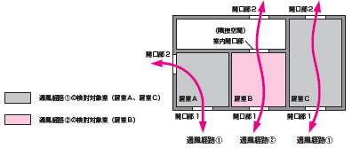
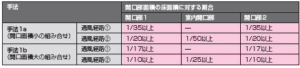
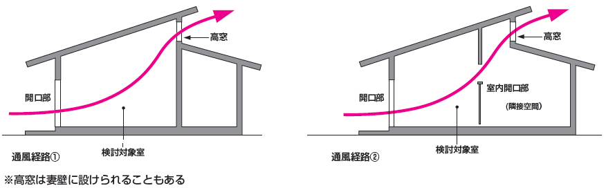
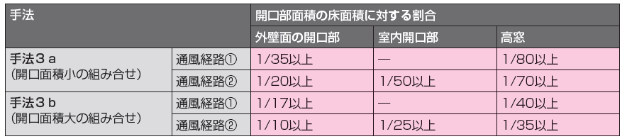
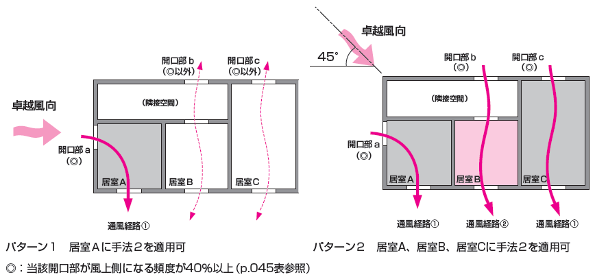

== 自然風の利用・制御

=== タブの下の表示項目

目標レベル A (冷房エネルギー削減率B%程度) +
換気回数 主たる居室:C回/h程度 その他の居室:D回/h程度

=== タブ下の説明

見出し::
自然風の利用・制御とは

説明::

====
夏期夜間や中間期など気象条件が温熱感覚上の体感改善に有効な場合に、外気を通風という形で積極的に取り入れ、冷房エネルギー消費の削減と 快適性の向上を実現することを目的とした技術です。
====

=== 環境条件

NOTE: <<GL_natural_ventilation_location>> の内容を埋め込み

=== 入力

[[NV_main_room]]
==== 主たる居室

===== a. 自然風の利用の有無 [選択入力]

説明::

====
通風の利用の程度を入力する方法を選択します。本計算方法では、換気回数を直接選択する方法と、通風利用手法を選択する方法があります。
====

選択肢::
* 自然風を利用しない・評価しない [規定値]
* 自然風の利用手法を選択して省エネルギー効果を評価する
* 換気回数を選択して省エネルギー効果を評価する

===== b. 高窓の利用の有無 [選択入力]

表示条件::
「<<NV_main_room>>」「a. 自然風の利用の有無」=「自然風の利用手法を選択して省エネルギー効果を評価する」

説明::

====
通風を確保するには、外壁開口部（高窓でない窓）を利用する他、高窓（建物の上端に近い壁の高所に設置する頂側窓や、屋根面に設置する天窓など）を利用することも可能です。ここでは、外壁開口部を利用する場合を手法1、高窓を利用する場合を手法3としています。
====

選択肢::
* 利用しない [規定値]
* 利用する

===== c. 【手法1】通風経路上の開口部面積の確保 [選択入力]

表示条件::
「<<NV_main_room>>」「b. 高窓の利用の有無」＝「利用しない」

説明::

====
外気を室内に効果的に取り入れるためには、「入口」と「出口」の役割を果たす開口を異なる方位の壁面2面以上に設けることが必要です。2ヶ所の開口部と通風経路の取り方を手法1では2つの方法で考えます（[underline]#開口部と通風経路の取り方#）。通風経路①および②の経路上の開口部の面積が大きいほど、期待できる通風量（換気回数）が大きくなり、一般的に省エネルギー効果も大きくなります。手法1に必要とされる通風経路①と②の開口部面積の要件を各々2段階設定しました。開口部面積が小さい場合を手法1a、手法1aの開口部面積を2倍に大きくした場合を手法1bとしています（[underline]#開口部面積の要件#）。
====

【ポップアップ：開口部と通風経路の取り方】::
====
図の通風経路①は、1つの居室に方位を異にする2面の外気に開口を設けることで、通風を確保する方法です。また、通風経路②は、1つの居室で外気に面した開口部を1面にしかとれない場合に、室内開口部を介して隣接する空間に外気に面した開口部を設けることで、通風を確保する方法です。

図 通風経路の確保の方法
====

【ポップアップ：開口部面積の要件】::
====
開口部面積の要件を示します。
なお、ここで示す開口部面積の要件は外部に面した開口部1と2が同じ面積を確保できる想定で設定しています。通風経路上の開口部の面積に偏りがあり、片方の面積が下表の要件を満たさない場合には、「通風経路上の合成有効開口面積を算出して手法1の判定を行う方法」もあります。詳しくはガイドラインを参照してください。 +

表 通風経路上の開口部面積（手法1）の要件

床面積は、当該室の内法面積で算定されることが望ましいものの、算定を簡単にするため芯々面積でも構いません。通風経路①および②のケースとも、床面積は検討対象室の床面積について検討します。開口部面積は、通風のために一定時間開放できる部分の面積（開口部分の内法寸法で算出した面積）をいい、同一方位の外壁面に複数の開口部がある場合は、各々の面積を合算して扱うことができます。
====

選択肢::
* 開口部面積を確保していない [規定値]
* 開口部面積（小）の組み合わせを確保している（手法1a）
* 開口部面積（大）の組み合わせを確保している（手法1b）

===== d. 【手法3】高窓の利用 [選択入力]

表示条件::
「<<NV_main_room>>」「b. 高窓の利用の有無」＝「利用する」

説明::

====
高窓を利用して通風を確保する場合、風の入口は外壁開口部、出口は高窓となることが多く、その通風経路の取り方を、手法3では2つの方法で考えます（[underline]#高窓による通風経路確保の方法#）。風下側に高窓を設置することで大きな風圧係数差を得ることができるため、小さい高窓面積でも効果があります。さらに、高所に窓を設置することで、内外温度差によって生じる空気密度の差を生かして安定的に通風量を確保できる効果も期待出来ます。また、夜間の防犯への配慮の観点からも有効といえます。（[underline]#高窓を利用した通風経路上の開口部面積の要件#）
====

【ポップアップ：高窓による通風経路確保の方法】::
====
図の通風経路①は、1つの居室に方位を異にする2面の外気に開口を設けることで、通風を確保する方法です。また、通風経路②は、1つの居室で外気に面した開口部を1面にしかとれない場合に、室内開口部を介して隣接する空間に外気に面した開口部を設けることで、通風を確保する方法です。

図　高窓による通風経路の確保の方法
====

【ポップアップ：高窓を利用した通風経路上の開口部面積の要件】::
====
手法3では、高窓を風下側に配置することを想定しています。卓越風向が判明している場合には、高窓の方位が卓越風向の風下側と45度位内にあること、または、高窓の面する方位の風下側になる頻度が40%以上であることを要件とします。 +
通風経路①および②の経路上の開口部の面積が大きいほど、期待できる通風量（換気回数）が大きくなり、省エネルギー効果も大きくなります。手法3に必要とされる通風経路①と②の開口部面積の要件を各々2段階設定しました（下表）。開口部面積が小さい場合を手法3a、手法3aの開口部面積を2倍に大きくした場合を手法3bとしており、期待できる通風量（換気回数）は、手法3aは手法1aと、手法3bは手法1bと同等です。

表　高窓を利用した通風経路上の開口部面積（手法3）の要件

開口部面積比は、天井高2.4mの部屋の風下側屋根面に高窓を設置した場合を想定して算定した値になっています。
====

選択肢::
* 開口部面積を確保していない [規定値]
* 開口部面積（小）の組み合わせを確保している（手法3a）
* 開口部面積（大）の組み合わせを確保している（手法3b）

===== e. 【手法2】卓越風向に応じた開口部配置 [選択入力]

表示条件::
「<<NV_main_room>>」「a. 自然風の利用の有無」＝「自然風の利用手法を選択して省エネルギー効果を評価する」 かつ +
「<<GL_natural_ventilation_location>>」「b. 敷地周辺の密集度」＝「立地2：郊外型の立地(区域建蔽率が20%以下)」

説明::

====
周囲が開けた敷地（立地2：郊外型の立地）では、開口部の一面を卓越風向（風上側）に向けて配置することで、流入開口部と流出開口部の間に大きな風圧係数差を確保でき、多くの通風量を得ることができます（[underline]#手法2の適用条件#）。なお、手法2は立地1（都市型の立地）には適用できません。
====

【ポップアップ：手法2の適用条件】::
====
卓越風向が判明している場合には、通風経路上の開口部一面の方位が卓越風向と45度以内にあること、あるいは、通風経路上の開口部一面の方位について風上側になる頻度が40%以上であることが、手法2の要件となります。
なお、自立循環型住宅のウェブサイト（[underline]#http://www.jjj-design.org#）の中で、自然風利用手法の検討を行うために整理した気象データ資料を参照できます。詳しい使い方については、ガイドラインを参照してください。

図　手法2の達成要件のパターン
====

選択肢::
* 適用しない [規定値]
* 適用する

===== f. 換気回数を入力する [数値入力]

表示条件::
「<<NV_main_room>>」「a. 自然風の利用の有無」＝「換気回数を選択して省エネルギー効果を評価する」

説明::

====
換気回数を入力して省エネルギー効果を評価します。換気回数の計算方法については、こちら（[underline]#省エネ基準のPDFへリンク#）を参照してください。
====

入力規則::
最小値=0, 最大値=50, 小数点=0位(整数), 規定値=0

[[NV_other_room]]
==== その他の居室の自然風の利用

===== a. 自然風の利用の有無 [選択入力]

説明::

====
通風の利用の程度を入力する方法を選択します。本計算方法では、換気回数を直接選択する方法と、通風利用手法を選択する方法があります。
====

選択肢::
* 自然風を利用しない・評価しない [規定値]
* 自然風の利用手法を選択して省エネルギー効果を評価する
* 換気回数を選択して省エネルギー効果を評価する

===== b. 高窓の利用の有無 [選択入力]

表示条件::
「<<NV_other_room>>」「a. 自然風の利用の有無」＝「自然風の利用手法を選択して省エネルギー効果を評価する」

説明::

====
通風を確保するには、外壁開口部（高窓でない窓）を利用する他、高窓（建物の上端に近い壁の高所に設置する頂側窓や、屋根面に設置する天窓など）を利用することも可能です。ここでは、外壁開口部を利用する場合を手法1、高窓を利用する場合を手法3としています。
====

選択肢::
* 利用しない [規定値]
* 利用する

===== c. 【手法1】通風経路上の開口部面積の確保 [選択入力]

表示条件::
「<<NV_other_room>>」「b. 高窓の利用の有無」＝「利用しない」

説明::

====
外気を室内に効果的に取り入れるためには、「入口」と「出口」の役割を果たす開口を異なる方位の壁面2面以上に設けることが必要です。2ヶ所の開口部と通風経路の取り方を手法1では2つの方法で考えます（[underline]#開口部と通風経路の取り方#）。通風経路①および②の経路上の開口部の面積が大きいほど、期待できる通風量（換気回数）が大きくなり、一般的に省エネルギー効果も大きくなります。手法1に必要とされる通風経路①と②の開口部面積の要件を各々2段階設定しました。開口部面積が小さい場合を手法1a、手法1aの開口部面積を2倍に大きくした場合を手法1bとしています（[underline]#開口部面積の要件#）。
====

【ポップアップ：開口部と通風経路の取り方】::
====
図の通風経路①は、1つの居室に方位を異にする2面の外気に開口を設けることで、通風を確保する方法です。また、通風経路②は、1つの居室で外気に面した開口部を1面にしかとれない場合に、室内開口部を介して隣接する空間に外気に面した開口部を設けることで、通風を確保する方法です。

図 通風経路の確保の方法
====

【ポップアップ：開口部面積の要件】::
====
開口部面積の要件を示します。
なお、ここで示す開口部面積の要件は外部に面した開口部1と2が同じ面積を確保できる想定で設定しています。通風経路上の開口部の面積に偏りがあり、片方の面積が下表の要件を満たさない場合には、「通風経路上の合成有効開口面積を算出して手法1の判定を行う方法」もあります。詳しくはガイドラインを参照してください。 +

表 通風経路上の開口部面積(手法1)の要件

床面積は、当該室の内法面積で算定されることが望ましいものの、算定を簡単にするため芯々面積でも構いません。通風経路①および②のケースとも、床面積は検討対象室の床面積について検討します。開口部面積は、通風のために一定時間開放できる部分の面積（開口部分の内法寸法で算出した面積）をいい、同一方位の外壁面に複数の開口部がある場合は、各々の面積を合算して扱うことができます。
====

選択肢::
* 開口部面積を確保していない [規定値]
* 開口部面積（小）の組み合わせを確保している(手法1a)
* 開口部面積（大）の組み合わせを確保している(手法1b)

===== d. 【手法3】高窓の利用 [選択入力]

表示条件::
「<<NV_other_room>>」「b. 高窓の利用の有無」＝「利用する」

説明::

====
高窓を利用して通風を確保する場合、風の入口は外壁開口部、出口は高窓となることが多く、その通風経路の取り方を、手法3では2つの方法で考えます（[underline]#高窓による通風経路確保の方法#）。風下側に高窓を設置することで大きな風圧係数差を得ることができるため、小さい高窓面積でも効果があります。さらに、高所に窓を設置することで、内外温度差によって生じる空気密度の差を生かして安定的に通風量を確保できる効果も期待出来ます。また、夜間の防犯への配慮の観点からも有効といえます。（[underline]#高窓を利用した通風経路上の開口部面積の要件#）
====

【ポップアップ：高窓による通風経路確保の方法】::
====
図の通風経路①は、1つの居室に方位を異にする2面の外気に開口を設けることで、通風を確保する方法です。また、通風経路②は、1つの居室で外気に面した開口部を1面にしかとれない場合に、室内開口部を介して隣接する空間に外気に面した開口部を設けることで、通風を確保する方法です。

図　高窓による通風経路の確保の方法
====

【ポップアップ：高窓を利用した通風経路上の開口部面積の要件】::
====
手法3では、高窓を風下側に配置することを想定しています。卓越風向が判明している場合には、高窓の方位が卓越風向の風下側と45度位内にあること、または、高窓の面する方位の風下側になる頻度が40%以上であることを要件とします。 +
通風経路①および②の経路上の開口部の面積が大きいほど、期待できる通風量（換気回数）が大きくなり、省エネルギー効果も大きくなります。手法3に必要とされる通風経路①と②の開口部面積の要件を各々2段階設定しました（下表）。開口部面積が小さい場合を手法3a、手法3aの開口部面積を2倍に大きくした場合を手法3bとしており、期待できる通風量（換気回数）は、手法3aは手法1aと、手法3bは手法1bと同等です。

表　高窓を利用した通風経路上の開口部面積（手法3）の要件

開口部面積比は、天井高2.4mの部屋の風下側屋根面に高窓を設置した場合を想定して算定した値になっています。
====

選択肢::
* 開口部面積を確保していない [規定値]
* 開口部面積（小）の組み合わせを確保している（手法3a）
* 開口部面積（大）の組み合わせを確保している（手法3b）

===== e. 【手法2】卓越風向に応じた開口部配置 [選択入力]

表示条件::
「<<NV_other_room>>」「a. 自然風の利用の有無」＝「自然風の利用手法を選択して省エネルギー効果を評価する」 +
「<<GL_natural_ventilation_location>>」「b. 敷地周辺の密集度」＝「立地2：郊外型の立地（区域建蔽率が20%以下）」

説明::

====
周囲が開けた敷地（立地2：郊外型の立地）では、開口部の一面を卓越風向（風上側）に向けて配置することで、流入開口部と流出開口部の間に大きな風圧係数差を確保でき、多くの通風量を得ることができます（[underline]#手法2の適用条件#）。なお、手法2は立地1（都市型の立地）には適用できません。
====

【ポップアップ：手法2の適用条件】 +
====
卓越風向が判明している場合には、通風経路上の開口部一面の方位が卓越風向と45度以内にあること、あるいは、通風経路上の開口部一面の方位について風上側になる頻度が40%以上であることが、手法2の要件となります。
なお、自立循環型住宅のウェブサイト（[underline]#http://www.jjj-design.org#）の中で、自然風利用手法の検討を行うために整理した気象データ資料を参照できます。詳しい使い方については、ガイドラインを参照してください。

図　手法2の達成要件のパターン
====

選択肢::
* 適用しない [規定値]
* 適用する

===== f. 換気回数を入力する [数値入力]

表示条件::
「<<NV_other_room>>」「a. 自然風の利用の有無」＝「換気回数を選択して省エネルギー効果を評価する」

説明::
====
換気回数を入力して省エネルギー効果を評価します。換気回数の計算方法については、こちら（[underline]#省エネ基準のPDFへリンク#）を参照してください。
====

入力規則::
最小値=0, 最大値=50, 小数点=0位(整数), 規定値=0
